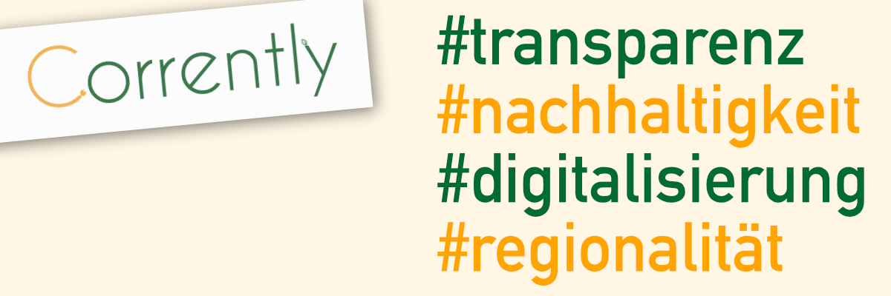

# node-red-contrib-corrently
Node RED Nodes to work with the Corrently Ecosystem in Germany

This is early stage development.

## Funding
This module is part of the Corrently Ecosystem which looks for funding in Germany:  https://www.stromdao.de/crowdfunding/info

